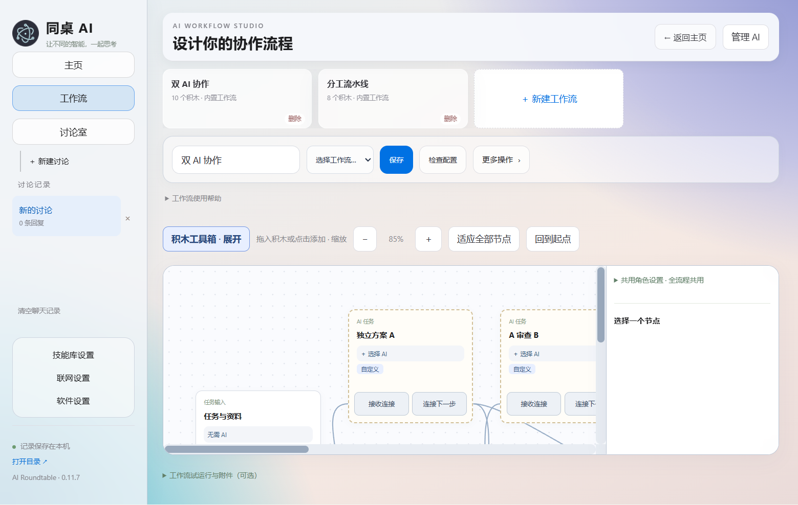
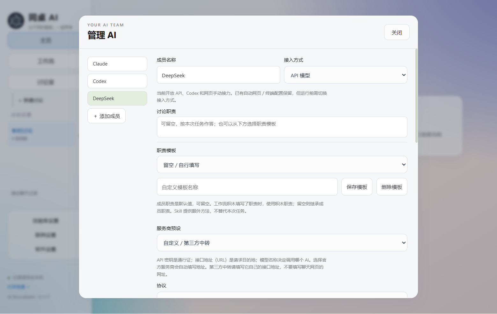

# AI Roundtable · 同桌 AI

**Bring different AIs to the same table.**

[简体中文](README.md)


This release also aligns page widths and forms, standardizes Manage AI / Discussion labels, and adds opaque fixed dialog headers. Esc exits full screen; Ctrl+= zooms in, Ctrl+- zooms out, and Ctrl+0 resets. Dark glass colors have a live preview. Completed workflow outputs appear separately in chat; switching workflows clears stale configuration notices.

**Response improvements:** streamed network-mode answers, concurrent independent tool queries and workflow nodes (including the same API/model), less repeated history rendering, and sticky close buttons and workflow controls. Workflow concurrency remains capped at three tasks; dependent nodes wait for their required inputs.

In member settings, use **Add another connection**, save its key and models, then select it in the original connection's pool. Requests use available connections with the same endpoint/protocol and matching model. Set 1–3 concurrent requests per connection. Errors do not rotate keys. Multiple keys may share account quotas, so additional keys do not guarantee proportional speed gains.

A local Windows and macOS app for AI collaboration. Continue with one model, or build visual workflows for planning, analysis, review and synthesis. Conversation history and collaboration mode are independent: switch models or workflows when returning to a task.

**0.11.8 — prerelease.** MIT licensed, independently developed, not affiliated with model providers.

## Get started

**Mac:** choose `macOS-arm64.dmg` for Apple silicon, or `macOS-x64.dmg` for Intel. Drag the app to Applications. ZIP alternatives are also available. Read the [Mac installation, storage and security notes](docs/macOS.md). The Mac preview has no Apple Developer ID signature or notarization.

**Added in 0.11.8:** a single provider's single model can now run an entire workflow; two distinct models are no longer required. This release also adds macOS builds for both architectures.

**Recommended: download `AI-Roundtable-0.11.8-Setup-x64.exe`.** Run the setup wizard, choose an installation folder and keep the desktop shortcut option selected. It installs for the current user without administrator privileges. Uninstalling retains user-created data and settings. Data from a separate portable installation is not imported automatically.

Alternatively, use the portable ZIP:

1. Open this repository's **Releases** and download **windows-x64.zip**. “Code → Download ZIP” contains source, not a ready-to-run app.
2. Extract the **entire archive** into a writable folder.
3. Run **AI-Roundtable.exe**. Keep all neighboring files and folders. Node.js is not required.
4. Configure your own API connection, connect an installed Codex, or use manual copy-and-paste with a web model.

To create a desktop shortcut, run **Create-Desktop-Shortcut.cmd** after extraction, or select **Create desktop shortcut** in app settings. It uses the app icon and supports paths with spaces or Chinese characters. Recreate it after moving the app folder. Do not run it inside the ZIP.

The EXE and windows-x64 ZIP are for Windows x64. They are unsigned, without automatic updates. Check INSTALLER-SHA256SUMS.txt for the installer or SHA256SUMS.txt for Windows/source ZIP files; Mac checksums are provided separately. Do not disable system protections. No app account is required.

## Features

- Single-model conversations and visual workflows, independent of history selection.
- Serial/parallel branches, joins, human approval, execution and final output blocks.
- Per-block connection and model selection; editable responsibilities and reusable workflows.
- Dependency-aware recovery: errors do not cancel unrelated branches. Retry the selected block, reuse completed outputs and continue ready dependents; other failed blocks need separate retries.
- Local history and attachments; limited image, PDF and Office parsing; result export.
- Glass appearance, light/dark modes, colors, fonts and Chinese/English interface options.

## Connections and execution

### Screenshots



Blocks express dependencies, with model and responsibility settings per node. Captured from a clean demo instance without personal conversations.



Appearance and local preferences are managed together. The data path in this screenshot is replaced with a generic label.

| Connection | Scope |
| --- | --- |
| API | OpenAI Chat Completions / Anthropic Messages compatible endpoints; bring your own key and model |
| Codex | Locally installed and signed in; ordinary blocks are read-only, execution requires approval and a selected directory |
| Web models | Manual prompt/response copy-and-paste, without automated website control |

API blocks generate content; they do **not execute code on your computer**. An API model can write code, followed by a Codex execution block that saves, runs and verifies it. Access, vision support, latency and charges depend on the provider.

Generic terminal and automated website connections are disabled. Arbitrary loops and automatic conditional branches are unsupported. Optional network tools require configuration and do not give every model native search.

## Privacy and upgrades

On Windows, history, settings and copied attachments live in the adjacent `data` folder by default. On Mac, they live in `~/Library/Application Support/AI Roundtable/data`. Relocation is available in settings. Keys are encrypted for the current operating-system account. There is no cloud sync. Selected context and files are sent to the chosen provider when running tasks; local storage does not mean offline inference.

The release script builds in a new directory using a file allowlist, excluding developer credentials, conversations, attachments and browser sessions. Never publish your own `data`, `instance` or `data-location.json`.

To upgrade, close the app, back up its folder and any relocated data, and extract the new version into a separate empty folder. Before first launch, copy the old `data` folder for default storage; retain `data-location.json` for relocated storage. Keep backups until history is verified. Do not copy live data. Moving Windows accounts requires re-entering keys.

## Development and releases

Source belongs in the repository; portable binaries belong in Releases. With Node.js 22+:

```powershell
node --test tests/*.test.cjs
./scripts/release.ps1 -Download
node scripts/verify-release.cjs
# Replace the example path with this build's actual ZIP
./scripts/build-installer.ps1 -PortableZip "dist/release-<id>/AI-Roundtable-0.11.8-windows-x64.zip" -DownloadCompiler
```

Core tests require no third-party dependencies. The build fetches and verifies a pinned Electron runtime. Output: `dist/release-<unique-id>/`. GitHub Actions tests and builds pushes and pull requests; maintainers review and attach ZIP files and checksums to versioned Releases. Use commits, branches and pull requests for changes, updating package.json and release notes.

For local development: `npm install`, then `npm start`. See [ARCHITECTURE.md](ARCHITECTURE.md). Electron/Chromium, PDF.js and JSZip retain their own licenses in the runtime and `third-party`.

## Limitations and feedback

Passing tests does not guarantee correctness in every environment. Some backend errors and native dialogs remain Chinese. Custom names and conversation content are not translated. Long context is truncated; parsing has no OCR and model format support varies. Retries may incur charges; partial replies are not automatically resent. Provider calls and Codex depend on the user's environment.

Report reproducible issues with versions and redacted screenshots. Never include keys, private conversations or files. Contributions are welcome.
